# DroidForensix

**Automated Android malware static-analysis pipeline** — extract C2 infrastructure from bytecode without execution.

[](https://python.org)
[](https://react.dev)
[](LICENSE)
[](https://github.com/DarshakPatel2004/project-zero/actions/workflows/test.yml)

> **63x speedup** over manual analysis (277-sample article run). **1,711 C2 indicators** extracted from **277 malware samples** across 12 countries. **75% concentrated** in Chinese cloud providers. Dataset since grown to **527 ground-truth rows (409 malware + 100 benign + 18 pendrive GT-only)**.
>
> **Read this before citing headline numbers:** exact-match family identification is **40.3% overall / 72.0% on specific families** (full 409-malware set, Sep 2026); the dedicated mal/ben classifier scores **90.0% (5-fold CV)**; only **2.4% of raw extracted indicators confirmed as genuine C2** — see [Evaluation](#evaluation). Raw counts above reflect extraction coverage, not verified accuracy.

---

## Table of Contents

- [What It Does](#what-it-does)
- [Key Results](#key-results)
- [Architecture](#architecture)
- [Quick Start](#quick-start)
- [Dashboard](#dashboard)
- [API Reference](#api-reference)
- [Evaluation](#evaluation)
- [Testing](#testing)
- [Project Structure](#project-structure)
- [Environment Variables](#environment-variables)
- [Known Limitations](#known-limitations)
- [Future Work](#future-work)

---

## What It Does

DroidForensix analyzes Android APKs **without execution** — no emulator, no sandbox. It decompiles bytecode to Java, traces method calls, extracts hardcoded indicators, correlates them against threat feeds, geolocates C2 servers, and produces a structured report.

**The problem it solves:** Manual APK analysis takes ~1 hour per sample. This pipeline does it in ~1 minute (~90 s on the LLM path, ~24 s with heuristic skip).

```
APK → Decompile (JADX) → Trace Suspicious APIs → Extract Indicators
      → Correlate (VT, OTX, Shodan, Censys) → Geolocate → Score → Report
```

### Pipeline

The 22-step pipeline (`analysis/step1_*.py` … `step22_*.py`, orchestrated by `analysis/pipeline.py:run_pipeline`):

1. **Extract** APK (AndroGuard: manifest, permissions, components)
2. **Enumerate** Dalvik bytecode strings via JADX
3. **Detect** encodings (base64, hex, XOR, ciphers)
4. **Decode** obfuscated strings
5. **Extract** C2 indicators (domains, IPs, hardcoded URLs, API endpoints)
6. **Correlate** across VT, OTX, Shodan, Censys (parallel threat feeds)
7. **Assess** findings via LLM (Ollama/NVIDIA NIM/OpenRouter)
8. **Analyze** obfuscation (packing, reflection, custom encryption)
9. **Post-process** dedup, scoring, report assembly
10. **Detect** binary packing
11. **Cluster** strings for decryption correlation
12. **Trace** reflective method calls
13. **Analyze** native ELF libraries
14. **Analyze** network protocols
15. **Correlate** reflective permissions
16. **Analyze** signing certificates
17. **Cluster** samples by family
18. **Synthesize** threat intelligence report
19. **Repair** containers (Container Repair)
20. **Crack** payload KDFs (Payload KDF Cracking)
21. **Deobfuscate** strings (String Deobfuscation)
22. **Consolidate** dropper IOCs (Dropper IOC Consolidation)

`run_pipeline()` supports `stop_after=N` (stop after step N — `stop_after=6` feeds the mal/ben classifier with no LLM calls) and `skip_steps={...}` (skip e.g. encoding detection on giant APKs). Step 1/2/3 timeouts are 600 s.

Output: structured JSON + PDF with per-phase timing.

---

## Key Results

> This table documents the published 277-sample run (see [Publication](#publication)). The dataset has since grown to **527 ground-truth rows**: 409 malware + 100 benign with APKs on disk, plus 18 pendrive rows (GT-only). Sep 2026 additions below the table.

| Metric | Value |
|--------|-------|
| Samples analyzed | 277 (204 timed) |
| C2 indicators extracted | **1,711** |
| Unique IPs | 203 (191 geolocated, 94%) |
| Geographic clusters | 26 across 12 countries |
| Chinese cloud concentration | **75%** (Alibaba, Tencent, CHINANET) |
| Pipeline speed (LLM path) | ~1.5 min/sample |
| Pipeline speed (heuristic skip) | ~0.4 min/sample (~40% of samples) |
| Total runtime (204 samples) | 3.2 hours sequential |
| Speedup vs. manual | **63x** |
| Recall (after heuristic fix) | **95%** (recovered from 80%) |
| Family-ID accuracy (exact match, 352 GT) | **64.2%** (226/352); **68.6%** on specific families |
| Family-ID accuracy (exact match, full 409 GT, Sep 2026) | **40.3%** (165/409); **72.0%** on specific families (131/182) |
| Mal/ben classifier (RandomForest, Sep 2026) | **90.0%** 5-fold CV accuracy (F1 0.937) on 509 samples; 3–15 s/APK, no LLM |
| Indicator precision (validated, 380 indicators) | **2.4%** confirmed malicious; **68%** clearly benign |

### What I Got Wrong (And Fixed)

This section is intentional — research is iterative, and documenting mistakes is as important as documenting wins.

- **LLM bottleneck:** Initial pipeline called Ollama per-sample synchronously. Fixed with a heuristic pre-filter that skips the LLM layer for ~40% of benign-looking samples (~2x speedup).
- **Heuristic over-optimization:** An aggressive string-entropy filter was dropping valid C2 domains. Disabled after validation (3% recall drop → 95% recall recovered).
- **Threat intel layer design:** Initial design queried feeds sequentially. Rewrote to parallel async requests (5s → 800ms per sample).
- **LLM as binary classifier (Sep 2026):** `llm_assessment.severity`/`risk_score` capped mal/ben separation at ~65% (malware median risk 50 vs benign mean 46; 111/409 malware scored `low` like benign). Replaced with a dedicated RandomForest on 20 static features from steps 1–6 → 90.0% CV. Forensics and classification are now separate tasks (`analysis/classify_fast.py`).
- **Pattern-matching C2 without context (Sep 2026):** any non-allowlisted URL scored as C2, so `accounts.snapchat.com` (OAuth) and `ktor.io` (library docs) flagged as C2. Fixed with a Tier-3 allowlist (`analysis/step5_allowlists.py`: OAuth + CDN + library docs) plus Tier-1 VT-tracker / Tier-2 hoster-reputation scaffolding (`analysis/step5_tiers.py`). Residual floods (map-tile/an ad-tracker apps emitting thousands of URLs) are documented, not scored.
- **Ground-truth filename/hash mismatch (Sep 2026):** three `modern_eval` GT rows keyed files by the wrong hash (one pointed at a duplicate copy; the true 30 MB sample behind `b16abfbd` is corrupt on AndroZoo itself — no ZIP central directory). Fixed paths to byte-verified files; the corrupt sample is kept as a zero-feature anti-analysis case.

---

## Architecture

```mermaid
flowchart LR
    A[APK Input] --> B[AndroGuard<br/>Manifest, Permissions]
    A --> C[JADX<br/>Bytecode → Java]
    C --> D[Suspicious API Tracer]
    B --> D
    D --> E[Indicator Extraction<br/>Domains, IPs, Strings]
    E --> F[Threat Intel<br/>VT, OTX, Shodan, Censys]
    F --> G[Geolocation<br/>MaxMind GeoLite2]
    G --> H[Confidence Scoring]
    H --> I[Report<br/>JSON + PDF]

    style A fill:#0f172a,stroke:#06b6d4
    style D fill:#111827,stroke:#f59e0b
    style F fill:#111827,stroke:#8b5cf6
    style I fill:#0f172a,stroke:#10b981
```



---

## Quick Start

### Prerequisites

- **Python 3.10+**
- **Git**
- **Ollama** (for LLM threat assessment) — [Download](https://ollama.com)
- **API keys** for threat intel feeds (optional, see `.env.example`)

The repo ships portable copies of JADX, APKTool, JDK, and Node.js under `tools\`.

### Setup

```bash
git clone https://github.com/DarshakPatel2004/project-zero.git
cd project-zero

python -m venv venv
source venv/bin/activate      # Linux/macOS
# or: venv\Scripts\Activate.ps1  (Windows)

pip install -r requirements-lock.txt   # pinned, reproducible
cp .env.example .env
```

### Run

Open three terminals:

```bash
# Terminal 1: Ollama (LLM backend)
ollama serve

# Terminal 2: Backend
python -m backend.main       # serves on http://localhost:8000

# Terminal 3: Frontend (optional)
cd frontend
npm install
npm run dev                 # serves on http://localhost:5173
```

Submit an APK via the dashboard (drag-and-drop) or CLI:

```bash
curl -X POST http://localhost:8000/analyze \
  -H "Content-Type: application/json" \
  -d '{"apk_path": "samples/malware/example.apk"}'
```

Or run headless:

```bash
python -m analysis.pipeline samples/malware/example.apk
```

Output is written to `analysis/work/<sha256>/pipeline_result.json`.

---

## Dashboard

The React dashboard provides layered analysis views:

| View | Description |
|------|-------------|
| **Glance** | Threat summary with score, family, red-flag indicators |
| **Family Attribution** | Collapsible card with primary match, confidence bars, related samples |
| **Dissection** | Tabs for Manifest, Permissions, Components, Code (syntax-highlighted), Strings, DEX (entropy chart), Native Libs |
| **Threat Chains** | Interactive chain viewer with built-in decoders (Base64, hex, URL, XOR, custom JS) |
| **Threat Intel** | MITRE ATT&CK mapping, VT/OTX hit counts, Shodan host profiles |

### Frontend Setup

```bash
cd frontend
npm install
npm run dev
```

### Component Hierarchy

```mermaid
graph TD
    App[App.jsx] --> UP[UploadPanel]
    App --> SS[SampleSearch]
    App --> LS[LoadingSpinner]
    App --> TB[ThreatBadge]
    App --> SD[SampleDetail]
    App --> AV[AnalysisView]

    SD --> TSum[ThreatSummary]
    SD --> AE[AttributionEvidence]
    SD --> DT[DissectionTabs]

    DT --> MT[ManifestTab]
    DT --> PT[PermissionsTab]
    DT --> CT[ComponentsTab]
    DT --> CodeT[CodeTab]
    DT --> ST[StringsTab]
    DT --> DX[DEXTab]
    DT --> NL[NativeLibsTab]

    AV --> OV[ObfuscationView]
    AV --> MV[ManifestView]
    AV --> FS[FamilySignalsCard]
    AV --> TS[ThreatSynthesisPanel]

    style App fill:#0f172a,stroke:#06b6d4
    style SD fill:#111827,stroke:#f59e0b
    style DT fill:#111827,stroke:#8b5cf6
```



---

## API Reference

| Method | Path | Description |
|--------|------|-------------|
| GET | `/` | Health check |
| GET | `/api/samples` | List analyzed samples |
| GET | `/api/sample/{sample_id}` | Full analysis report |
| GET | `/api/sample/{sample_id}/attribution` | MAFIA attribution evidence |
| GET | `/api/sample/{sample_id}/threat-summary` | Threat summary (glance) |
| GET | `/api/sample/{sample_id}/dissection` | Full dissection data |
| GET | `/api/sample/{sample_id}/dissection/{manifest\|permissions\|components\|dex\|classes\|strings}` | Per-tab dissection data |
| GET | `/api/sample/{sample_id}/code-analysis/{class}` | Method-level code analysis |
| GET | `/api/graph/{sample_id}` | 3D graph data |
| GET | `/api/clusters` | Clustering data |
| GET | `/api/timeline/{sample_id}` | Attack-chain timeline |
| POST | `/api/upload` | Upload APK for analysis |
| POST | `/analyze` | Trigger APK analysis |
| WS | `/ws` | Real-time analysis events |

---

## Evaluation

- **527 ground-truth rows** (`ground_truth_all_corrected.csv`): AndroZoo-Drebin (149 malware), abusech (121), F-Droid (100 benign), AndroZoo (76), modern_eval (63), pendrive (18 GT-only, no APKs on disk). 509 samples have APKs and full step-1–6 features.
- **Top malware families (corrected GT):** FakeInstaller (25), Opfake (21), Plankton (17), DroidKungFu (16), GinMaster (15), NGate (15), SpyNote (14), TeaBot (13), Ermac (12), Hydra (11), FakeTikTok (11), BaseBridge (10)
- Full metadata in `sample_metadata.csv`

### Indicator False-Positive Validation (Aug 2026)

Every indicator the pipeline auto-extracted from 22 malware samples (380 total) was manually reviewed:

| Classification | Count | Share |
|----------------|-------|-------|
| Confirmed malicious (C2 / exfiltration endpoint) | 9 | 2.4% |
| Suspicious but unverified | 111 | 29% |
| Clearly benign (Firebase, Google OAuth, CDNs, Mono runtime paths) | 260 | **68%** |

An automated pass over 21 samples (439 indicators) produced the same split: **299 benign (68%), 129 suspicious, 11 malicious**. A domain-legitimacy check of 285 domains landed **68 junk / 134 benign / 75 suspicious / 8 malicious**.

**What this means:** indicator extraction is high-recall, low-precision. The headline "1,711 C2 indicators" is an *extraction* count — only a low single-digit percent survives manual review as genuine C2. Most false positives come from:
- Legitimate Google infrastructure (Firebase analytics, OAuth client IDs, `*.googleusercontent.com`)
- CDN/content domains (`i.ytimg.com`, `www.srgb.com`, assoc-amazon)
- Mono/.NET runtime paths (`*.cc` files) flagged by the "unusual protocol" heuristic
- `.top`/`.xyz` TLD heuristics hitting parked or sinkholed domains

Raw review data is committed in `evaluation_results/`: `fp_final_report.json`, `fp_validation_auto.json`, `legitimacy_check.json`, `indicators_extracted.json`, `fp_validation_results.json`.

### Family-Identification Accuracy (352-sample validation, Aug 2026)

Exact-match family accuracy against corrected ground truth is **64.2% (226/352)** overall and **68.6% (216/315)** when only specific (non-catch-all) families are counted.

**Why this number is trustworthy:** the ground truth was independently re-verified against VirusTotal (291) and MalwareBazaar (168) — all 459 samples `confirmed_external` — then corrected with an authoritative resolution order (filename prefix → MalwareBazaar signature → GT specific → VT recheck → verified pipeline C2 evidence → MB tags). This replaced the old GT where **48.5%** of labels were catch-alls (AndroidOS, GenericKD, Agent, Banker, Gen, ...) that inflated naive scoring. The old 32.0% figure was measured on that inflated label set; after correction the same engine scored 17.3%, and the upgraded engine below recovered to 64.2%.

**How the engine improved:** three layers work together:
1. **signature_v3** (hand-written families) — fires on 70 samples at 92.9% precision (65/70; all 5 misses are Plankton false positives).
2. **knowledge-base matcher** (new) — discriminators mined from the corrected GT (`analysis/family_knowledge_base.json`, 38 families; ≥2 matched tokens + an anchor token at ≤5% corpus FP). Offline mining precision ~95%; 76.3% precision on the re-eval (151/198 fires).
3. **LLM with candidate guidance** (new prompt) — the context now lists candidate families with their actually-matched signals plus observable evidence strings, turning open recall into a multiple-choice decision. The old prompt showed only string *counts* and refused 63.8% of samples (229/359); with the new prompt the LLM produces a verdict on 84/352 samples while the knowledge base handles the rest.

### Reproducibility (352-sample family validation)

The validation metrics are committed and reproducible with the tooling in the repo:

```bash
# Re-mine the family knowledge base from corrected GT
python analysis/mine_family_knowledge.py

# Re-run family identification on cached pipeline results (needs Ollama running)
python evaluation/reeval_families.py --output-dir evaluation/metrics_v2

# Compute metrics against the corrected ground truth
python evaluation/metrics_recompute.py \
    --gt ground_truth_all_corrected.csv \
    --predictions evaluation/metrics_v2/predictions.json \
    --output-dir evaluation/metrics_v2
```

Headline metrics (exact-match family accuracy, corrected ground truth):

| Metric | Value |
|--------|-------|
| Overall | 64.2% (226/352) |
| Specific families only (non-catch-all) | 68.6% (216/315) |
| High-confidence specific labels | 70.0% (189/270) |
| Unknown-refusal (GT = `unknown`) | 30.3% (10/33) |

Per source (accuracy on specific families): AndroZoo-Drebin 68.5% (149 specific), MalwareBazaar 77.0% (87), modern_eval 63.8% (47), AndroZoo 83.3% (12), abusech 35.0% (20).

Remaining misses are honest: Opfake/FakeInstaller/FakeChrome leave no observable static signal (opaque obfuscation), and toolkit-shared families (TeaBot↔Hydra↔Ermac↔FluBot) are hard even for human analysts.

### Family-Identification Accuracy (full 409-malware set, Sep 2026)

Re-measured on all 409 malware with fresh step-1–6 features and Tier-3 C2 filtering (`evaluation/metrics_v4/`):

| Metric | Value |
|--------|-------|
| Overall | 40.3% (165/409) |
| Specific families only (non-catch-all) | **72.0%** (131/182) |
| High-confidence specific labels | 73.1% (114/156) |
| Unknown-refusal (GT = `unknown`) | 46.0% (34/74) |

Per source (overall / specific): AndroZoo-Drebin 63.8% / 79.8% (149), AndroZoo 44.7% / 83.3% (76), modern_eval 44.4% / 64.3% (63), abusech 6.6% / 34.8% (121).

The overall figure dropped vs the 352-sample 64.2% **because of GT composition, not regression**: the added abusech batch is 81% generic AV catch-all labels (`AndroidOS`, `GenericKD`, `Agent`, …) that exact-match can never score. The meaningful metric — specific-family accuracy — **rose 68.6% → 72.0%**. Scores are bit-identical whether features come from the full pipeline or `stop_after=6`, confirming the fast path loses nothing for family ID.

```bash
# Re-run family identification on step-1–6 features (needs Ollama running)
python evaluation/reeval_families.py --output-dir evaluation/metrics_v4

# Compute metrics against the corrected ground truth
python evaluation/metrics_recompute.py \
    --gt ground_truth_all_corrected.csv \
    --predictions evaluation/metrics_v4/predictions.json \
    --output-dir evaluation/metrics_v4 --verbose
```

### Malicious-vs-Benign Classifier (Sep 2026)

The LLM severity score capped mal/ben separation at ~65%, so classification is now a dedicated RandomForest (300 trees) on 20 static features from steps 1–6 (class counts, permissions, string/C2/payload/secret counts, MasterKey flags) — no LLM calls:

| Metric | Value |
|--------|-------|
| Accuracy (5-fold CV, 509 samples) | **90.0%** |
| F1 / Precision / Recall | 0.937 / 0.938 / 0.927 |
| Holdout (80/20) | 89.2% acc, confusion `[[15,5],[6,76]]` |
| Inference speed | 3 s (tiny APK) – 15 s (7 MB APK) |

Top signals are structural (`decompiled_classes`, `total_strings`, `num_dangerous_perms`) — C2 count contributes only ~0.04 importance. Model + features committed: `evaluation/classifier_data/{malben_rf.pkl,features.csv,malben_report.json}`.

```python
from analysis.classify_fast import classify_malware_fast
is_malicious, confidence = classify_malware_fast("sample.apk")  # (True, 80.2)
```

### C2 Context Tiers (Sep 2026)

Step-5 extraction replaced bare pattern-matching with tiers (`analysis/step5_allowlists.py`, `analysis/step5_tiers.py`):
- **Tier 3** (live): OAuth/CDN/library-docs allowlist — `accounts.snapchat.com`, `ktor.io`, `logback.qos.ch` no longer score as C2 (98 records demoted; top-FP benign 135 → 20 C2s).
- **Tier 1** (measured): VirusTotal tracker check — 3/155 malware IPs (`176.65.134.52`, `38.190.225.166`, `38.47.213.197`) and 1/60 domains (`depositmobi.com`, freq 36) confirmed tracked. Thin yield: most extracted C2s are legit, junk, or dead infrastructure.
- Residual floods (OsmAnd 4,494 tile URLs, DuckDuckGo 7,092) are counted as split features (`num_c2_real` vs fallback-IP), not verdicts.

### Validation Status

| Criterion | Status |
|-----------|--------|
| Methodology documented | ✅ |
| Threat feeds integrated | ✅ |
| Code open-source | ✅ |
| Sample APKs collected | ✅ |
| Recall on balanced set | ✅ 95% |
| Speedup verified | ✅ 63x (204 timed samples) |
| Family-ID accuracy vs ground truth | ✅ measured: 72.0% specific-family (409 samples, corrected GT) |
| Mal/ben accuracy vs ground truth | ✅ measured: 90.0% 5-fold CV (509 samples) |
| FP rate validation | ✅ measured: 68% of indicators clearly benign, 2.4% confirmed malicious (380 indicators, 22 samples) |
| Comparative aggregator validation | ⏳ Future work |

## Known Limitations

- **Indicator precision is low**: 68% of auto-extracted indicators are clearly benign strings; only 2.4% were confirmed as genuine C2 in manual review (see [validation](#evaluation)). Heuristics favor recall over precision by design.
- **Family identification is imperfect**: 72.0% specific-family accuracy on the 409-malware corrected ground truth (40.3% overall — dragged down by unscorable abusech catch-all labels) — opaque-obfuscation families (Opfake, FakeChrome) and toolkit-shared families (TeaBot↔Hydra↔Ermac↔FluBot) remain hard; treat family output as advisory.
- **Mal/ben errors concentrate** on packed `unknown`-family malware (6 FN) and permission-heavy benign (7 FP); one AndroZoo-hosted sample is byte-corrupt (no ZIP directory) and yields zero features by design.
- Encrypted native libraries flagged for manual inspection
- Reflection-heavy obfuscation handled by heuristics (not perfect)
- C2-blind malware (zero static artifacts) — documented limitation

## Future Work

- **Threat Synthesis Engine:** Multi-sample attribution clustering (Q1 2027)
- **Dynamic Validation:** Frida-based runtime confirmation of static C2 candidates (Q2 2027)
- **String decryption correlation:** Cipher.doFinal tracing — expected +5-10% recall

---

## Testing

### Backend (Python)

```bash
pytest tests/ -v
```

### Frontend (React)

```bash
cd frontend
npm test     # 247 tests across 38 test files — all pass
```

CI runs both suites on every push and PR.

---

## Project Structure

```
backend/          — FastAPI server, threat intel integration, pipeline logic
frontend/         — React dashboard (Leaflet C2 maps, FamilySignalsCard, threat chains)
analysis/         — 22-step pipeline (extraction → decoding → correlation → synthesis → report) + `classify_fast.py` mal/ben inference
scripts/          — Batch analysis, data collection utilities
data/             — GeoIP databases, YARA rules
evaluation_results/ — Committed validation results (FP review, family-ID metrics)
evaluation/       — metrics_v4 (full-set family scores), c2_analysis (FP/FN/tracker data), classifier_data (features + mal/ben model)
tests/            — Python backend tests (pytest)
docs/             — Dashboard guide, codebase reference, superpower plans
```

---

## Environment Variables

Copy `.env.example` to `.env`:

```bash
cp .env.example .env
```

Key variables:

| Variable | Required | Description |
|----------|----------|-------------|
| `NVIDIA_NIM_API_KEY` | Optional | NVIDIA NIM (preferred LLM backend) |
| `OLLAMA_HOST` | Optional | Local Ollama endpoint |
| `OPENROUTER_API_KEY` | Optional | Cloud LLM (Qwen, Gemma) |
| `VT_KEY` | Optional | VirusTotal API |
| `OTX_KEY` | Optional | AlienVault OTX |
| `SHODAN_KEY` | Optional | Shodan host search |
| `CENSYS_TOKEN` | Optional | Censys Platform API |

### Publication

Read the full article: **"Static Analysis Beats Sandboxing. Here's How I Analyzed 277 Malware Samples in 3.2 Hours."**

Key article sections:
- The hypothesis: Static analysis extracts infrastructure faster than sandboxing
- Real findings: Coverage, accuracy, performance metrics (all reproducible)
- What I got wrong: Mistakes discovered and fixed (LLM bottleneck, heuristic over-optimization)
- Limitations: Encrypted libraries, reflection obfuscation, C2-blind malware
- Next: Threat Synthesis Engine (multi-sample attribution, Q1 2027)

---

## License

MIT
