# DroidForensix

**Automated Android malware static-analysis pipeline** — extract C2 infrastructure from bytecode without execution.

[](https://python.org)
[](https://react.dev)
[](LICENSE)
[](https://github.com/DarshakPatel2004/DroidForensix/actions/workflows/test.yml)

> **63x speedup** over manual analysis. **1,711 C2 indicators** extracted from **277 malware samples** across 12 countries. **75% concentrated** in Chinese cloud providers.

---

## Table of Contents

- [What It Does](#what-it-does)
- [Key Results](#key-results)
- [Architecture](#architecture)
- [Quick Start](#quick-start)
- [Dashboard](#dashboard)
- [API Reference](#api-reference)
- [Research](#research)
- [Testing](#testing)
- [Project Structure](#project-structure)
- [Known Limitations](#known-limitations)

---

## What It Does

DroidForensix analyzes Android APKs **without execution** — no emulator, no sandbox. It decompiles bytecode to Java, traces method calls, extracts hardcoded indicators, correlates them against threat feeds, geolocates C2 servers, and produces a structured report.

**The problem it solves:** Manual APK analysis takes 3.2 hours per sample. This pipeline does it in ~90 seconds.

```
APK → Decompile (JADX) → Trace Suspicious APIs → Extract Indicators
      → Correlate (VT, OTX, Shodan, Censys) → Geolocate → Score → Report
```

### 9-Step Pipeline

1. **Decompose** APK via AndroGuard (manifest, permissions, components)
2. **Decompile** Dalvik bytecode → Java via JADX
3. **Analyze** method calls for suspicious APIs (WebSocket, shell exec, reflection)
4. **Extract** indicators (domains, IPs, hardcoded strings, API endpoints)
5. **Map** permission-to-capability relationships
6. **Correlate** across VT, OTX, Shodan, Censys (parallel threat feeds)
7. **Geolocate** C2 servers, identify cloud provider, cluster by region
8. **Score** confidence based on method call frequency + contextual evidence
9. **Report** structured JSON + PDF with per-phase timing

---

## Key Results

| Metric | Value |
|--------|-------|
| Samples analyzed | 277 (204 timed) |
| C2 indicators extracted | **1,711** |
| Unique IPs | 203 (191 geolocated, 94%) |
| Geographic clusters | 26 across 12 countries |
| Chinese cloud concentration | **75%** (Alibaba, Tencent, CHINANET) |
| Pipeline speed (LLM path) | ~1.5 min/sample |
| Pipeline speed (heuristic skip) | ~0.4 min/sample (~40% of samples) |
| Total runtime (204 samples) | 3.2 hours sequential |
| Speedup vs. manual | **63x** |
| Recall (after heuristic fix) | **95%** (recovered from 80%) |

### What I Got Wrong (And Fixed)

This section is intentional — research is iterative, and documenting mistakes is as important as documenting wins.

- **LLM bottleneck:** Initial pipeline called Ollama per-sample synchronously. Fixed with a heuristic pre-filter that skips the LLM layer for ~40% of benign-looking samples (~2x speedup).
- **Heuristic over-optimization:** An aggressive string-entropy filter was dropping valid C2 domains. Disabled after validation (3% recall drop → 95% recall recovered).
- **Threat intel layer design:** Initial design queried feeds sequentially. Rewrote to parallel async requests (5s → 800ms per sample).

---

## Architecture

```mermaid
flowchart LR
    A[APK Input] --> B[AndroGuard<br/>Manifest, Permissions]
    A --> C[JADX<br/>Bytecode → Java]
    C --> D[Suspicious API Tracer]
    B --> D
    D --> E[Indicator Extraction<br/>Domains, IPs, Strings]
    E --> F[Threat Intel<br/>VT, OTX, Shodan, Censys]
    F --> G[Geolocation<br/>MaxMind GeoLite2]
    G --> H[Confidence Scoring]
    H --> I[Report<br/>JSON + PDF]

    style A fill:#0f172a,stroke:#06b6d4
    style D fill:#111827,stroke:#f59e0b
    style F fill:#111827,stroke:#8b5cf6
    style I fill:#0f172a,stroke:#10b981
```



---

## Quick Start

### Prerequisites

- **Python 3.10+**
- **Git**
- **Ollama** (for LLM threat assessment) — [Download](https://ollama.com)
- **API keys** for threat intel feeds (optional, see `.env.example`)

The repo ships portable copies of JADX, APKTool, JDK, and Node.js under `tools\`.

### Setup

```bash
git clone https://github.com/DarshakPatel2004/DroidForensix.git
cd DroidForensix

python -m venv venv
source venv/bin/activate      # Linux/macOS
# or: venv\Scripts\Activate.ps1  (Windows)

pip install -r requirements-lock.txt   # pinned, reproducible
cp .env.example .env
```

### Run

Open three terminals:

```bash
# Terminal 1: Ollama (LLM backend)
ollama serve

# Terminal 2: Backend
python -m backend.main       # serves on http://localhost:8000

# Terminal 3: Frontend (optional)
cd frontend
npm install
npm run dev                 # serves on http://localhost:5173
```

Submit an APK via the dashboard (drag-and-drop) or CLI:

```bash
curl -X POST http://localhost:8000/analyze \
  -H "Content-Type: application/json" \
  -d '{"apk_path": "samples/malware/example.apk"}'
```

Or run headless:

```bash
python -m analysis.pipeline samples/malware/example.apk
```

Output is written to `analysis/work/<sha256>/pipeline_result.json`.

---

## Dashboard

The React dashboard provides layered analysis views:

| View | Description |
|------|-------------|
| **Glance** | Threat summary with score, family, red-flag indicators |
| **Family Attribution** | Collapsible card with primary match, confidence bars, related samples |
| **Dissection** | Tabs for Manifest, Permissions, Components, Code (syntax-highlighted), Strings, DEX (entropy chart), Native Libs |
| **Threat Chains** | Interactive chain viewer with built-in decoders (Base64, hex, URL, XOR, custom JS) |
| **Threat Intel** | MITRE ATT&CK mapping, VT/OTX hit counts, Shodan host profiles |

### Frontend Setup

```bash
cd frontend
npm install
npm run dev
```

### Component Hierarchy

```mermaid
graph TD
    App[App.jsx] --> AV[AnalysisView]
    App --> UP[UploadPanel]
    App --> SS[SampleSearch]

    AV --> LS[LoadingState]
    AV --> RV[ResultView]
    RV --> OV[OverviewTab]
    RV --> ST[SecretsTab]
    RV --> LLM[LLMSummaryTab]
    RV --> DS[DissectionSummaryTab]
    RV --> OV2[ObfuscationView]
    RV --> MV[ManifestView]
    RV --> TS[ThreatSynthesisPanel]
    RV --> FS[FamilySignalsCard]

    OV --> FS
    DS --> CT[ChainsTab]

    style App fill:#0f172a,stroke:#06b6d4
    style AV fill:#111827,stroke:#f59e0b
    style RV fill:#111827,stroke:#8b5cf6
```



---

## API Reference

| Method | Path | Description |
|--------|------|-------------|
| GET | `/` | Health check |
| GET | `/api/samples` | List analyzed samples |
| GET | `/api/sample/{sample_id}` | Full analysis report |
| GET | `/api/sample/{sample_id}/attribution` | MAFIA attribution evidence |
| GET | `/api/sample/{sample_id}/threat-summary` | Threat summary (glance) |
| GET | `/api/sample/{sample_id}/dissection` | Full dissection data |
| GET | `/api/sample/{sample_id}/dissection/{section}` | Per-tab dissection data |
| GET | `/api/sample/{sample_id}/code-analysis/{class}` | Method-level code analysis |
| GET | `/api/graph/{sample_id}` | 3D graph data |
| GET | `/api/clusters` | Clustering data |
| GET | `/api/timeline/{sample_id}` | Attack-chain timeline |
| POST | `/api/upload` | Upload APK for analysis |
| POST | `/analyze` | Trigger APK analysis |
| WS | `/ws` | Real-time analysis events |

---

### Evaluation

- **306 Android APKs** from 49 malware families across 4 sources (AndroZoo, MalwareBazaar, Pendrive, Modern Eval)
- **Top families:** Cerberus (16), Hydra (11), TeaBot (11), Ermac (10), SpyNote (8), Anubis (6), Flubot (6)
- Full metadata in `sample_metadata.csv`

### Reproducibility (359-sample family validation)

All family-identification metrics are recomputed from committed inputs with one command:

```bash
python evaluation/metrics_recompute.py --verbose
```

Generated from `ground_truth_all.csv` + `evaluation/validation_359_fixed/predictions.json`
(the fixed-signature run; baseline `validation_359_full/predictions.json` is retained);
outputs land in `evaluation/metrics/` (`metrics.json`, `per_source_accuracy.csv`, `per_family_breakdown.csv`).
Locked 2026-08-12 at commit `a333958`, re-locked after the signature fixes
(Iconosys/Plankton/SpyMax, see `git log`) — cross-checked against `validation_report.json`
(87 families, 4 sources — zero mismatches).

Headline metrics (exact-match family accuracy):

| Metric | Value |
|--------|-------|
| Overall | 32.0% (115/359) |
| Specific families only (non-catch-all) | 52.5% (93/177) |
| High-confidence specific labels | 55.6% (84/151) |
| Unknown-refusal (GT = `unknown`) | 91.7% (22/24) |

### Validation Status

| Criterion | Status |
|-----------|--------|
| Methodology documented | ✅ |
| Threat feeds integrated | ✅ |
| Code open-source | ✅ |
| Sample APKs collected | ✅ |
| Recall on balanced set | ✅ 95% |
| Speedup verified | ✅ 63x (204 timed samples) |
| FP rate validation | ⏳ ~10-15% estimated (50-indicator validation underway) |
| Comparative aggregator validation | ⏳ Future work |

### Known Limitations

- Encrypted native libraries flagged for manual inspection
- Reflection-heavy obfuscation handled by heuristics (not perfect)
- C2-blind malware (zero static artifacts) — documented limitation
- False positive rate: ~10-15% estimated

### Future Work

- **Threat Synthesis Engine:** Multi-sample attribution clustering (Q1 2027)
- **Dynamic Validation:** Frida-based runtime confirmation of static C2 candidates (Q2 2027)
- **String decryption correlation:** Cipher.doFinal tracing — expected +5-10% recall

---

## Testing

### Backend (Python)

```bash
pytest tests/ -v
```

### Frontend (React)

```bash
cd frontend
npm test     # 248 tests across 38 test files — all pass
```

CI runs both suites on every push and PR.

---

## Project Structure

```
backend/          — FastAPI server, threat intel integration, pipeline logic
frontend/         — React dashboard (Leaflet C2 maps, FamilySignalsCard, threat chains)
analysis/         — 9-step pipeline (extraction → decoding → correlation → report)
scripts/          — Batch analysis, data collection utilities
data/             — GeoIP databases, YARA rules
evaluation/       — Validation metrics, ground truth, FP analysis
tests/            — Python backend tests (pytest)
docs/             — Dashboard guide, codebase reference, superpower plans
```

---

## Environment Variables

Copy `.env.example` to `.env`:

```bash
cp .env.example .env
```

Key variables:

| Variable | Required | Description |
|----------|----------|-------------|
| `NVIDIA_NIM_API_KEY` | Optional | NVIDIA NIM (preferred LLM backend) |
| `OLLAMA_HOST` | Optional | Local Ollama endpoint |
| `OPENROUTER_API_KEY` | Optional | Cloud LLM (Qwen, Gemma) |
| `VT_KEY` | Optional | VirusTotal API |
| `OTX_KEY` | Optional | AlienVault OTX |
| `SHODAN_KEY` | Optional | Shodan host search |
| `CENSYS_TOKEN` | Optional | Censys Platform API |

### Publication

Read the full article: **"Static Analysis Beats Sandboxing. Here's How I Analyzed 277 Malware Samples in 3.2 Hours."**

Key article sections:
- The hypothesis: Static analysis extracts infrastructure faster than sandboxing
- Real findings: Coverage, accuracy, performance metrics (all reproducible)
- What I got wrong: Mistakes discovered and fixed (LLM bottleneck, heuristic over-optimization)
- Limitations: Encrypted libraries, reflection obfuscation, C2-blind malware
- Next: Threat Synthesis Engine (multi-sample attribution, Q1 2027)

---

## License

MIT
