# DroidForensix Design System

```mermaid
graph TD
    A[:root — Design Tokens] --> B[Base Styles]
    B --> C[Typography Scale<br/>.text-xs, .heading-sm, etc.]
    B --> D[Color Utilities<br/>.text-muted, .text-rose, etc.]
    B --> E[Spacing Utilities<br/>.p-4, .mt-2, .flex, etc.]
    C --> F[Component Classes<br/>.card, .badge, .threat-badge]
    D --> F
    E --> F
    F --> G[Page Patterns<br/>.secrets-header, .secret-item]
    G --> H[Inline Styles<br/>Dynamic colors, widths, delays]

    style A fill:#1e293b,stroke:#06b6d4
    style F fill:#0f172a,stroke:#f43f5e
    style G fill:#111827,stroke:#f59e0b
    style H fill:#1f2937,stroke:#94a3b8
```



**Cascade order:** Tokens → Base → Utilities → Components → Page patterns. Inline styles only for computed values (conditional colors, dynamic widths, animation delays).

## Typography Scale

| Class       | Size   | Weight | Use                    |
|-------------|--------|--------|------------------------|
| `.heading-xl` | 24px | 700 | Page titles            |
| `.heading-lg` | 20px | 600 | Section headers        |
| `.heading-md` | 18px | 600 | Panel titles           |
| `.heading-sm` | 16px | 600 | Card headings          |
| `.text-lg`    | 16px | —  | KPI values, hero text  |
| `.text-base`  | 14px | —  | Body text, paragraphs  |
| `.text-sm`    | 12px | —  | Labels, helpers        |
| `.text-xs`    | 10px | —  | Metadata, timestamps   |

**Color utilities:** `.text-muted`, `.text-secondary`, `.text-soft`, `.text-subtle`, `.text-dim`, `.text-nav`, `.text-rose`, `.text-amber`, `.text-emerald`, `.text-cyan`, `.text-violet`

## Spacing Scale

| Variable        | Rem  | Pixels | Common use           |
|-----------------|------|--------|----------------------|
| `--space-xs`    | —    | 4px    | Tight gaps           |
| `--space-sm`    | —    | 8px    | List item gaps       |
| `--space-md`    | 1rem | 16px   | Card padding, gaps   |
| `--space-lg`    | 1.5rem| 24px  | Section spacing      |
| `--space-xl`    | 2rem | 32px   | View padding         |
| `--space-2xl`   | 2.5rem| 40px  | Loading states       |

## Core Colors

```
--bg-primary:    #0b0f19   (page background)
--bg-secondary:  #111827   (card alt background)
--bg-surface:    #1f2937   (card/surface background)
--bg-card:       #0d1320   (dark card variant)

--ink:           #e7eef8   (primary text)
--text-primary:  #f8fafc   (headings)
--text-secondary:#94a3b8   (body)
--text-muted:    #64748b   (help text)
--text-subtle:   #56657b   (labels)

--accent-rose:   #f43f5e
--accent-amber:  #f59e0b
--accent-emerald:#10b981
--accent-cyan:   #06b6d4
--accent-violet: #8b5cf6

--line:          rgba(148,163,184,0.12)   (borders)
```

## Layout

```
--sidebar-width:  238px
--header-height:  64px
--radius-sm:      6px
--radius-md:      10px
--radius-lg:      16px
```

## Key Component Classes

### `.badge` — Pill label
```css
.badge { display: inline-flex; align-items: center; padding: 0.2rem 0.6rem;
  border-radius: 999px; font-size: 0.7rem; font-weight: 600; }
```
`badge-cyan`, `badge-rose`, `badge-amber`, `badge-emerald`, `badge-violet`, `badge-slate`

### `.card` — Base container
```css
.card { background: var(--bg-surface); border: 1px solid var(--border-color);
  border-radius: var(--radius-md); box-shadow: var(--shadow-sm); }
.card-dark { background: var(--bg-card); border: 1px solid var(--line); }
.card-empty { text-align: center; padding: var(--space-xl); }
.card h3 { margin: 0 0 0.75rem 0; }  .card h4 { margin: 0 0 0.5rem 0; }
.card p { margin: 0 0 0.5rem 0; line-height: 1.6; color: var(--text-secondary); }
```

### `.threat-badge` — Colored severity pill
```css
.threat-badge { display: inline-block; padding: 0.35rem 1.2rem;
  border-radius: var(--radius-sm); font-size: var(--text-sm);
  font-weight: 700; text-transform: uppercase; color: #fff; }
```
`threat-badge-bg-critical`, `-high`, `-medium`, `-low`, `-unknown`

### `.code-block` — Monospace item with rose border
```css
.code-block { padding: 0.6rem 0.75rem; margin-bottom: 0.35rem;
  background: var(--bg-secondary); border-left: 3px solid var(--accent-rose);
  border-radius: 4px; font-size: var(--text-sm); }
.code-block-header { font-weight: 500; }
.code-block-detail { font-size: var(--text-xs); color: var(--text-muted); margin-top: 0.25rem; }
```

### `.section-title` — Uppercase label
```css
.section-title { font-size: var(--text-sm); font-weight: 600;
  text-transform: uppercase; letter-spacing: 0.08em;
  color: var(--text-secondary); margin: 0 0 var(--space-md); }
```

### `.detail-list` — Key behaviors / actions list
```css
.detail-list { padding-left: 1.25rem; }
.detail-list li { margin-bottom: var(--space-sm); line-height: 1.5; }
```

### `.secrets-header` — SecretsTab top bar
```css
.secrets-header { display: flex; align-items: center; gap: var(--space-md);
  flex-wrap: wrap; margin-bottom: var(--space-md); padding: var(--space-md);
  background: var(--bg-surface); border: 1px solid var(--border-color);
  border-radius: var(--radius-md); }
```

### `.secret-item` — Individual secret finding card
```css
.secret-item { padding: 14px; background: var(--bg-surface);
  border: 1px solid var(--border-color); border-radius: var(--radius-md);
  display: flex; flex-direction: column; gap: 8px; }
.secret-item-value { font-family: monospace; font-size: 12px;
  color: var(--accent-cyan); word-break: break-all; }
```

## Spacing Utilities

```
.p-2  (8px)   .p-4  (16px)  .p-6  (24px)  .p-8  (32px)  .p-10 (40px)
.mt-1 (4px)   .mt-2 (8px)   .mt-3 (12px)
.mb-2 (8px)   .mb-3 (12px)  .mb-4 (16px)
.gap-2 (8px)  .gap-3 (12px)
.flex .flex-col .items-center .justify-center .flex-wrap .text-center .text-right
.align-middle .max-w-480
```

## Rules

1. **No hardcoded hex outside `:root`.** Use `var(--*)` everywhere.
2. **Define classes before inline.** If a style is repeated, add a CSS class.
3. **Inline only for computed values.** Dynamic colors, widths, animation delays belong inline.
4. **Component classes > global utilities.** Scoped CSS prevents cross-component leaks.
5. **Typography maps to the scale.** Don't set `font-size: 13px` — is it `.text-sm` or `.text-base`?

## Convention Notes

- All component CSS files import their own `.css` in the component JSX.
- `index.css` loads first (design tokens, base reset, shared patterns).
- `AnalysisView.css`, `App.css`, etc. override only what differs.
- Inline `style={{}}` count: **12 in AnalysisView.jsx**, **0 in App.jsx** (all computed: colors, widths, delays).
